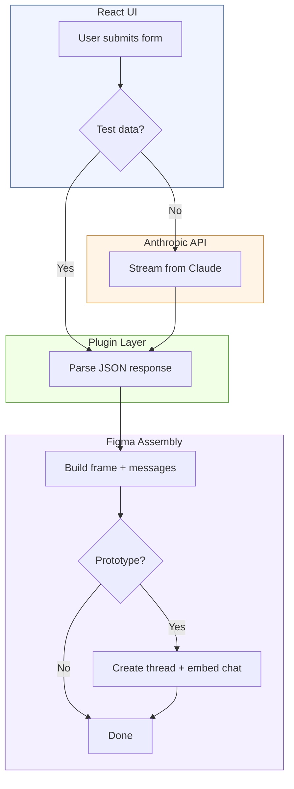
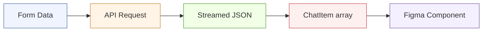

# End-to-End Flow

```mermaid
flowchart TD
    subgraph UI["React UI"]
        A[User submits form] --> B{Test data?}
    end

    subgraph API["Anthropic API"]
        B -->|No| C[Stream from Claude]
    end

    subgraph PLUGIN["Plugin Layer"]
        B -->|Yes| D[Load test data]
        C --> D[Parse JSON response]
    end

    subgraph FIGMA["Figma Assembly"]
        D --> E[Build frame + messages]
        E --> F{Prototype?}
        F -->|Yes| G[Create thread + embed chat]
        F -->|No| H[Done]
        G --> H
    end

    style UI fill:#f0f4ff,stroke:#4a6fa5
    style API fill:#fff4e6,stroke:#c4873b
    style PLUGIN fill:#f0ffe6,stroke:#5a9e3c
    style FIGMA fill:#f5f0ff,stroke:#7b5ea7
```

## Data Pipeline

```mermaid
flowchart LR
    A[Form Data] --> B[API Request] --> C[Streamed JSON] --> D[ChatItem array] --> E[Figma Component]

    style A fill:#f0f4ff,stroke:#4a6fa5
    style B fill:#fff4e6,stroke:#c4873b
    style C fill:#f0ffe6,stroke:#5a9e3c
    style D fill:#fff0f0,stroke:#c44b4b
    style E fill:#f5f0ff,stroke:#7b5ea7
```
